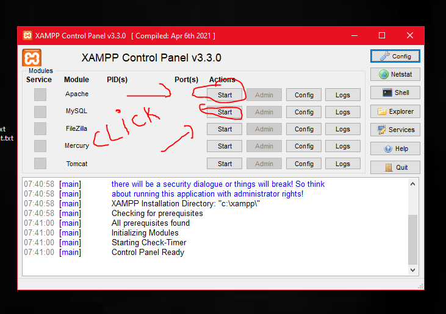

👋 Hello 👋

Have You Cloned My Project ?, But you did have some problems to run It 🤔?

In This Read Me File I Will Show You The Exact Etapes To setup your envirement , Lets Staaaaaaaaaaaart 🏃‍♂️🏃

# [1] First Of All You Need To Install Maven On You System :

-- Read The Instructions in this article and follow them : 👉 https://phoenixnap.com/kb/install-maven-windows 👈

-- To check if successfuly you installed maven run this cmd in your terminal : mvn -version

# [2] You Need A Server To Run This Project, For Me I choosed Tomcat 👍

-- Go to https://tomcat.apache.org/download-10.cgi and install The Version 10.1.14 as a zip file 🛑(Other Versions may not work with this project)🛑

-- Extract The Zip File in any location of Your Choice

# [3] How to run the project on tomcat : 

-- In The cloned Files From My Repo , Go to gather-grif-app -> target -> gathergrid-1.0.war , Then Copy the gathergrid-1.0.war

-- In The Folder Of Tomcat , Goto webapps and Past 📄 gathergrid-1.0.war 

# [4] MySql Server : 

-- Install Xamp from : 👉 https://www.apachefriends.org/download.html 👈

-- Lunch Xamp , Then Run Apache and MySql Modul ! The Image Will Show You How 

-- Go To Tomcat Folder , Then Go To bin folder , and click the script named startup.bat

-- Voilaaaa 👏👏 You Have Done It, No Open Your Browser and got to this link : 👉 http://localhost:8080/gathergrid/ 👈